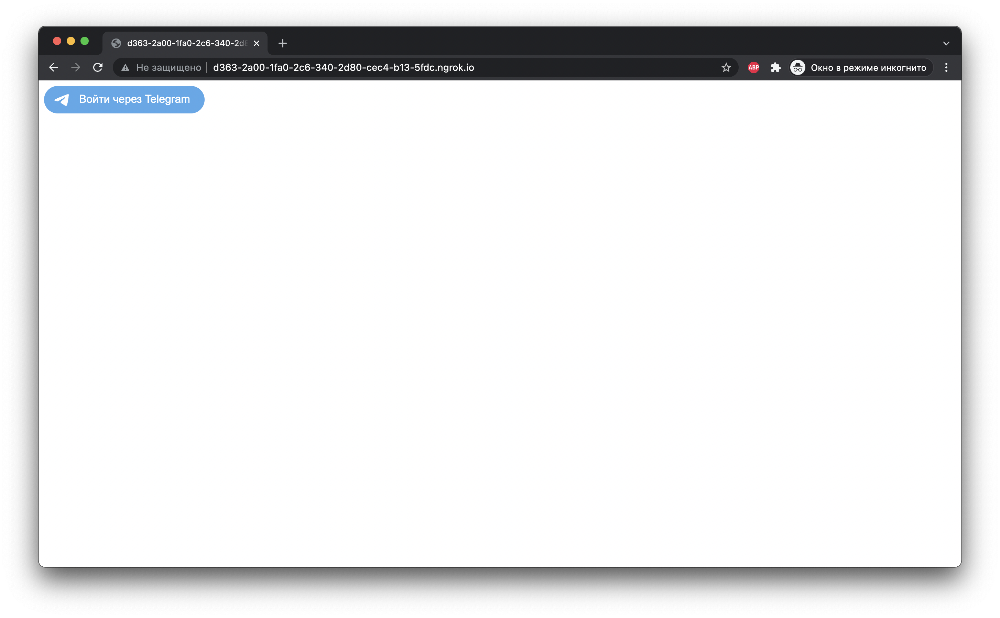

# Flask Telegram Login Example

Telegram предоставляет возможность внешним приложениям использовать авторизацию с помощью данных профиля пользователя. В этом руководстве подробно, шаг за шагом, рассматривается релизация получения данных пользователя для их дальнейшего использования в вашем приложении Flask.

## Создание бота
Для реализации авторизации через Telegram необходимо создать бота, для этого используется системный бот `@botfather`. 

Процесс создания очень прост, необходимо отправить команду `/newbot`, а затем указать публичное название бота и имя (username), которое обязательно должно оканчиваться на bot. После этого вы получите токен для дальнейшей работы с созданным ботом.

<p align="center">
    
</p>

## Конфигурация приложения

Полученный токен необходимо установить в переменную конфигурации TELEGRAM_BOT_TOKEN (app.py, 7 строка).
```
app.config['TELEGRAM_BOT_TOKEN'] = '5293850554:AAGUR_9HH19JM6Je0UCPzi3xqze0SrDLJN8'
```

А имя бота - в параметры скрипта авторизации (app.py, 16 строка).
```
data-telegram-login="flask_login_example_bot"
```

Также можно быстро сконфигурировать внешний вид и поведение виджета авторизации с помощью генератора на официальном сайте (https://core.telegram.org/widgets/login).

Далее запускаем приложение с помощью команды `python3 app.py`.

Авторизация с помощью Telegram не работает на локальном хосте, поэтому, для получения временного домена, будем использовать туннель ngrok (вы должны установить его, если он еще не установлен). Чтобы запустить туннель выполняем команду `ngrok http 8000`.

<p align="center">
    
</p>

Теперь нужно изменить домен в параметре скрипта авторизации data-auth-url (app.py, 18 строка).
```
data-auth-url="http://d363-2a00-1fa0-2c6-340-2d80-cec4-b13-5fdc.ngrok.io/login/telegram"
```

Затем необходимо привязать полученный домен к боту. Сделать это можно в диалоге с `@botfather` с помощью команды `/setdomain`.
<p align="center">
    
</p>


## Процесс авторизации
Если вы выполнили все предыдущие действия, то по адресу `http://d363-2a00-1fa0-2c6-340-2d80-cec4-b13-5fdc.ngrok.io` должен быть доступен виджет авторизации:
<p align="center">
    
</p>

После нажатия кнопки Telegram предложит авторизоваться в браузере:
<p align="center">
    
</p>

А затем запросит разрешение на передачу данных:
<p align="center">
    
</p>

В случае успешной авторизации вернутся следующие данные о пользователе:
- id – численный идентификатор пользователя
- first_name, last_name – имя и фамилия, установленные в профиле
- username – уникальное имя пользователя
- photo_url – ссылка на изображение аватара пользователя
- auth_date – дата авторазации в UNIX-формате
- hash – HMAC-подпись ответа на основе токена

<p align="center">
    
</p>

Используя полученные данные, можно создать нового пользователя (если идентификатор не найден в базе) или авторизовать его.

## Проверка полученных данных

Для проверки, что данные на самом деле пришли от Telegram, используется поле hash. В нем содержится HMAC-подпись передаваемых данных, основанная на токене бота. Подробнее об этом можно прочитать в официальной документации виджета авторизации (https://core.telegram.org/widgets/login#checking-authorization).

Проверка HMAC-подписи реализованна в функции `check_response`. При несовпадении полученного в запросе и вычисленного значения HMAC необходимо отменить авторизацию пользователя.
